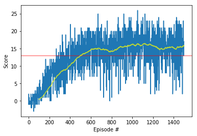
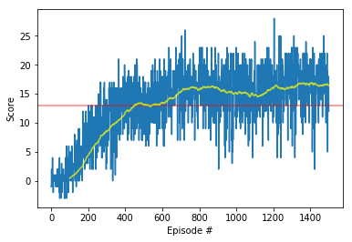

# Report of Project 1: Navigation

## Summary

Below learning algorithms were used for training this project.

* Deep Q Network learning (DQN)
* Double Deep Q Network learning (DDQN)

An agent should navigate to collect only yellow bananas as much as possible.

## Parameters
* Replay buffer size: 100000
* Minibatch size: 64
* Gamma(discount factor): 0.99
* Tau(for soft update of target parameters): 0.001 
* Learning rate: 0.0005 
* Update every(how often to update the network): 4
* Number of nodes in first hidden_layers: 64
* Number of nodes in second hidden_layers: 32
* Probability of dropout: 0.2

## Learning algorithms
###1. Deep Q Network learning (DQN)
* Reference: [Human-level control through deep reinforcement learning](https://storage.googleapis.com/deepmind-media/dqn/DQNNaturePaper.pdf) 
####1.1. Q value neural network
When predicting Q values, below neural networks were used instead of Q values table.
* Input nodes: states (size: 37)
* First linear layer: 37 (input), 64 (output)
* Leaky ReLU activation function
* Dropout
* Second linear layer: 64 (input), 32 (output)
* Leaky ReLU activation function
* Dropout
* Output linear layer: 32 (input), 4 (output)
* Output nodes: actions (size: 4)

####1.2. Experience replay buffer
The agent's experience stores on experience replay buffer.
It can be trained by multiple time.
Also, consecutive experiences make high correlation to over-fit.

For avoiding this problem, stored experiences sample randomly. 

####1.3. Fixed Q targets
Loss = Mean Squared Error(MSE) of (Q local network, Q target network)

Q local network is updated whenever an agent moves.
But, Q target network is only periodically updated to reduce correlations. 

####1.4. Results

Environment solved in 398 episodes!	Average Score: 13.02

Episode 1500	Average Score: 15.90

###2. Double Deep Q Network learning (DDQN)
* Reference: [Double DQN](https://arxiv.org/abs/1509.06461)

####2.1. What is different from DQN
The max operator in standard Q-learning and DQN,
uses the same values both to select and to evaluation an action.
This makes it more likely to select overestimated values,
resulting in overoptimistic value estimates.
To prevent this, the selection from the evaluation can be decoupled.

In ddqn_agent.py codes, when getting action to maximize Q value on target network,
local network are used instead of target network to reduce correlation.

####2.2. Results

Environment solved in 350 episodes!	Average Score: 13.06

Episode 1500	Average Score: 16.41

Result of DDQN is slightly better than result of DQN on this experiment.

###3. Future improvement
* [Prioritized experience replay](https://arxiv.org/abs/1511.05952)
: To learn more efficiently, it replay important transitions more frequently.
* [Rainbow: Combining Improvements in Deep Reinforcement Learning](https://arxiv.org/abs/1710.02298)
: This method combines several learning methods, and outperforms single other methods.
From this article, we can normally expect prioritized experience replay + DDQN is better than
only prioritized experience replay or DDQN.  